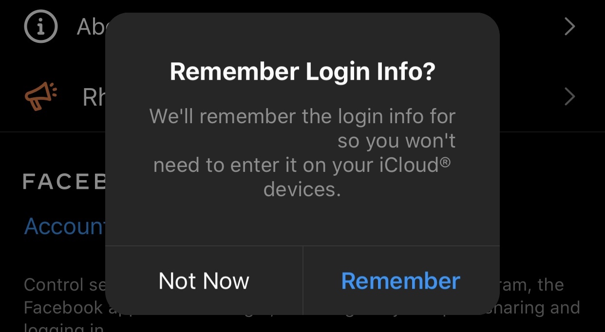

# Rhino for Instagram

A simple, powerful tool for Instagram

&nbsp;

## Download Link

* **Sideloading (No Jailbreak Required):** 
   
    | Application | Version | Rhino |
    | --- | --- | --- |
    | [Instagram](https://mega.nz/file/sM5lkThI#AWarD9M6mhKIo4l8flaUEibLnWfKDvPKo6tycNEwBmI) | 158.0 | 2.9.2 |
    | [Instagram **](https://mega.nz/file/tU4mkaQA#beZWwBcbBlcGXpe0_gBGDleTNEkwjQD3N9Svda24ar8) | 167.0 | 3.1.5 |

        
&nbsp;

## Issue
**

**Please note that Instagram v167 has issues and should only be used for devices that are incompatible with Instagram v158.0, particulary iPhone 12 Pro and iPhone 12 Pro Max.**

With version 167, the user must log in again when the app is closed. **I recommend you log out and tap "Remember Login Info" to quickly log in the app.** 
This version also prevents the action blocked error some users had in the past.

  

## How to Download

### Requirements

1. Install [AltServer](https://altstore.io/) for macOS or Windows 

### Simple Guide

* Download the ipa file from the link above and save it to your phone using iCloud Drive 

* With AltSever installed, install [AltStore](https://altstore.io/faq/)  

* In AltStore, tap the **+** button in **My Apps** and select the ipa file from your iCloud Drive 

### TODO 
A more thorough guide is needed!  

